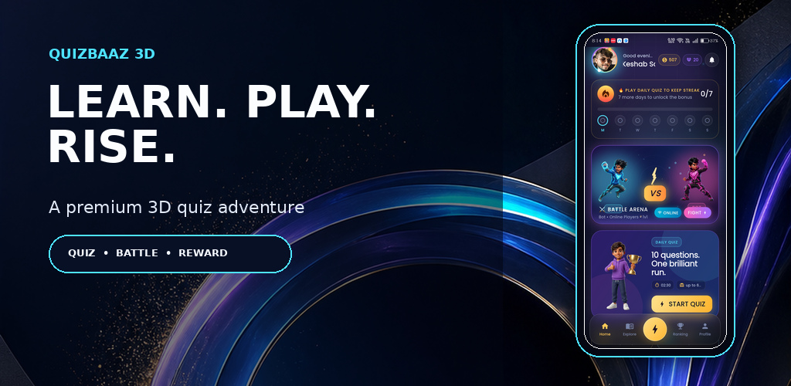
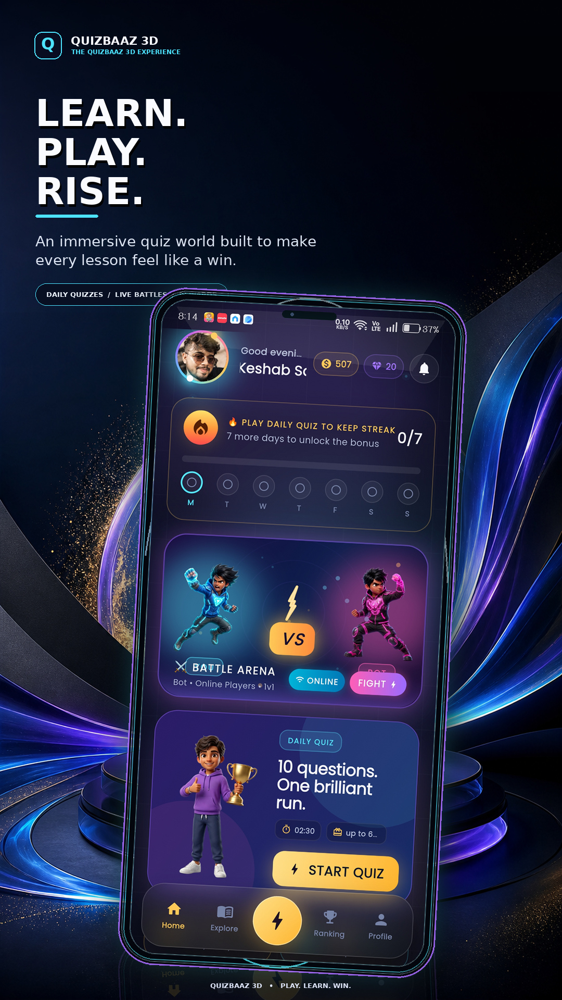
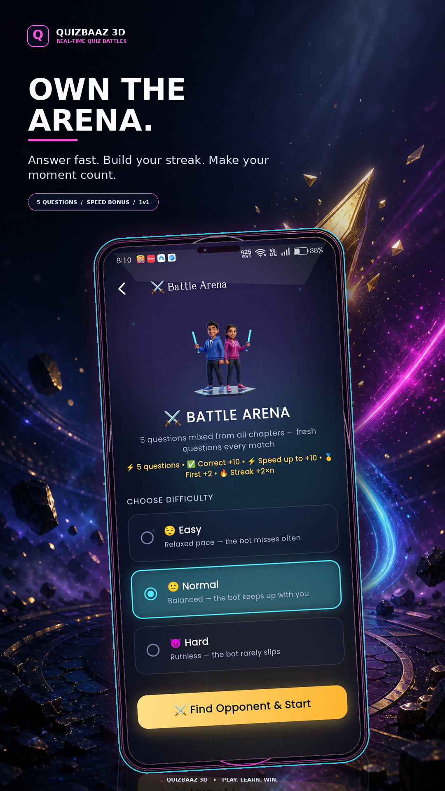
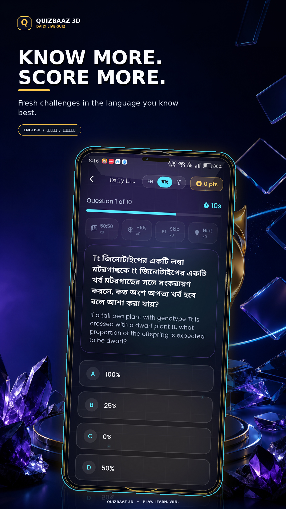
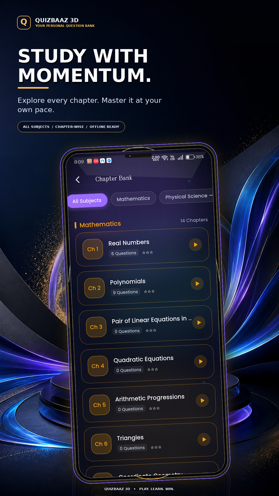
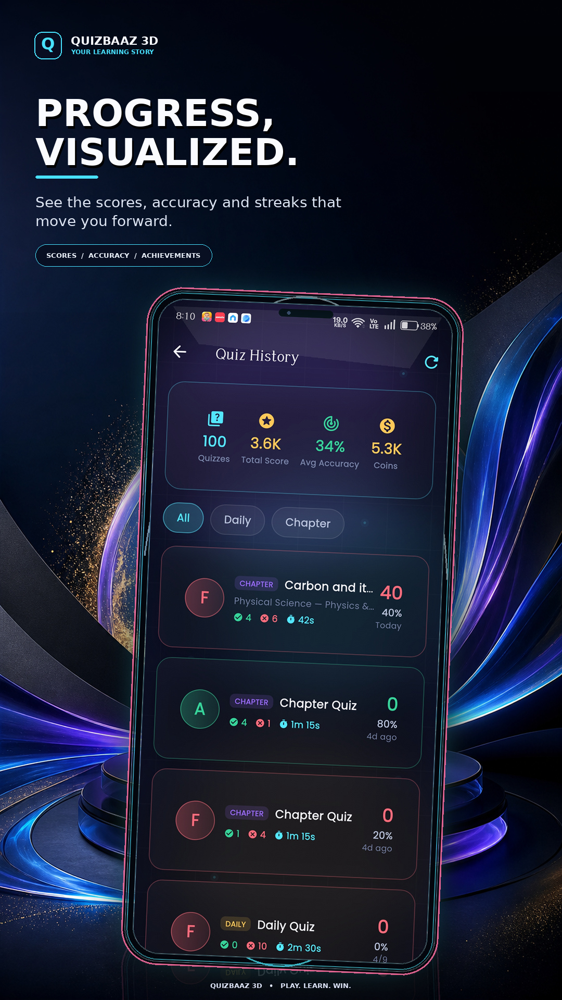
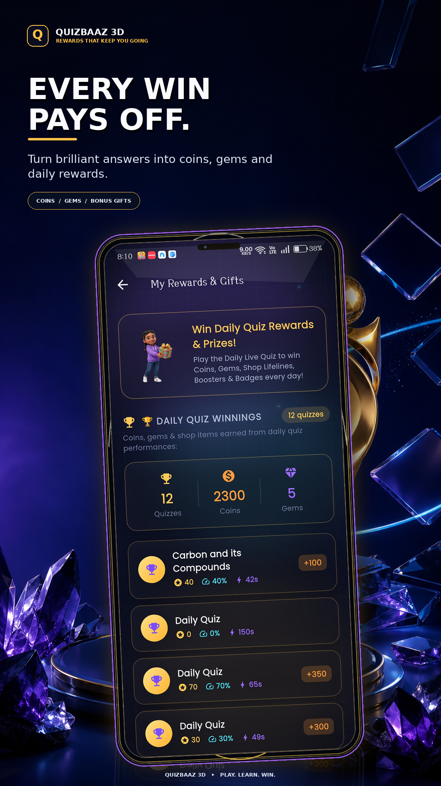
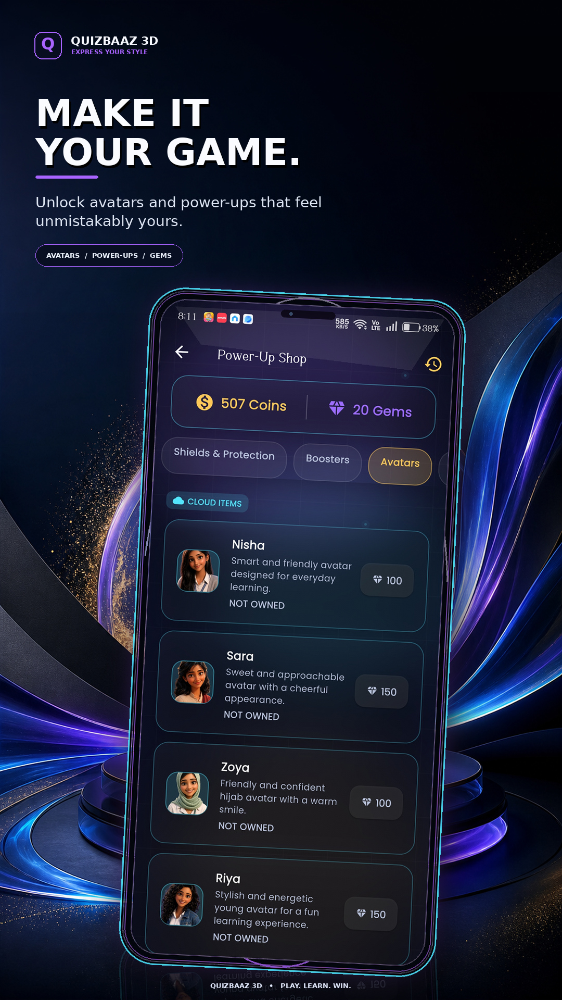
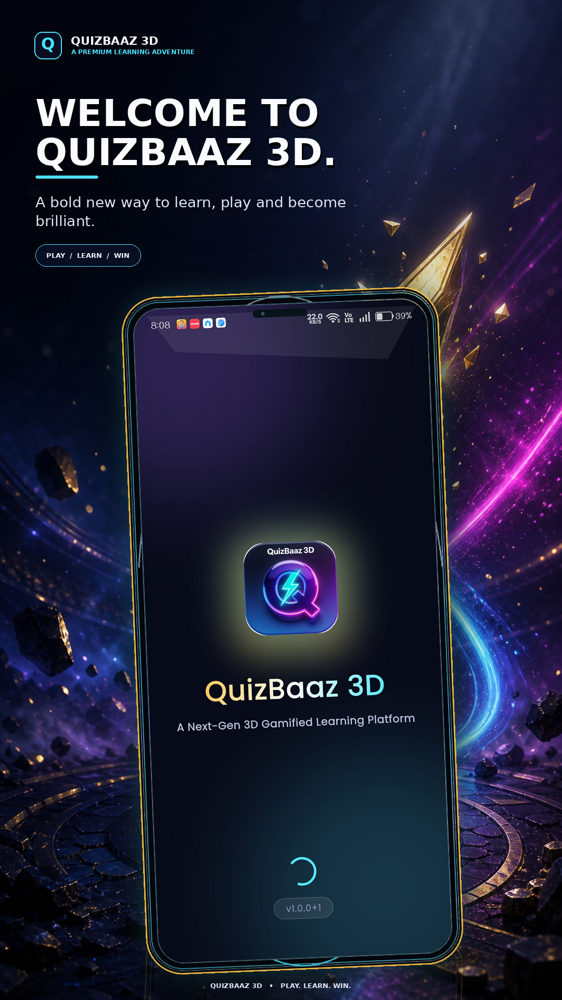

# 🚀 QuizBaaz 3D - Gamified Flutter Quiz & Learning Platform

<div align="center">

<a href="./marketing/play_store_ai_premium/BONUS_AI_Feature_Graphic_1024x500.jpg">
  
</a>

### **A Next-Gen 3D Gamified Quiz Platform built with Flutter**
*Chapter-Wise Question Bank • Daily 10-Question Live Quiz • Live Leaderboard • Yesterday's Champion & In-Game Rewards • 3D Streaks • Zero-Friction Guest Trial • Central Admin Panel*

[](https://flutter.dev)
[](https://dart.dev)
[](LICENSE)
[](https://github.com/Keshab1997/quizbaaz)

</div>

---

## ✨ A Premium Learning Experience

<p align="center">
  <strong>Learn. Play. Rise.</strong><br />
  <sub>Daily challenges, chapter-wise practice, real-time battles and rewards — all in one immersive 3D learning world.</sub>
</p>

<p align="center">
  <a href="./marketing/play_store_ai_premium/01_Learn_Play_Rise.jpg"></a>
  <a href="./marketing/play_store_ai_premium/02_Own_the_Arena.jpg"></a>
  <a href="./marketing/play_store_ai_premium/03_Know_More_Score_More.jpg"></a>
  <a href="./marketing/play_store_ai_premium/04_Study_with_Momentum.jpg"></a>
</p>

<p align="center">
  <a href="./marketing/play_store_ai_premium/05_Progress_Visualized.jpg"></a>
  <a href="./marketing/play_store_ai_premium/06_Every_Win_Pays_Off.jpg"></a>
  <a href="./marketing/play_store_ai_premium/07_Make_It_Your_Game.jpg"></a>
  <a href="./marketing/play_store_ai_premium/08_Welcome_to_QuizBaaz_3D.jpg"></a>
</p>

<p align="center">
  <a href="./marketing/play_store_ai_premium/"><strong>Explore the full Play Store creative kit →</strong></a>
</p>

---

## 🌟 Key Highlights & Features

1. **🎨 Glassmorphism & Neon Glow Dark UI:**
   - Futuristic Navy Blue + Purple Gradient aesthetic with realistic glossy glassmorphism cards and neon glowing borders.
2. **🏆 Daily 10-Question Competitive Quiz:**
   - 10 fresh questions every single day with real-time countdown timer, speed-based bonus scoring, and anti-cheat mechanisms.
3. **🥇 Yesterday's Champion & In-Game Rewards Tracker:**
   - Everyone on the home screen sees who won yesterday (#1 Podium with 3D trophy), their score, and what in-game reward they earned (Coins, Gems, Power-Ups, Shop Items).
4. **🔥 3D Daily Streak Fire Flame:**
   - Motivating daily streak system with interactive fire animations and weekly milestone rewards.
5. **📥 Genuinely Offline:**<br>
   - A cached chapter keeps working when the network drops: an aged cache is still served while a refresh is attempted in the background, so a chapter never turns into "no questions yet" mid-session.
6. **📚 Chapter-wise JSON Question Bank:**
   - Modular JSON-driven question banks organized by Categories and Chapters (General Science, Tech, History, Geography, Math, etc.).
7. **🚪 Zero-Friction Guest Trial Onboarding:**
   - Visitors can explore the dashboard and play trial quizzes immediately without forced registration, boosting user acquisition.
8. **🛡️ In-App Admin Control Panel (author-only):**
   - Chapter/subject manager, question bank with search and filters, review-before-append AI question generator (10 questions per run, trilingual), shop and avatar managers, question-count sync, audit log. Gated on the Firebase `admin` custom claim, so ordinary accounts never see it.
9. **🌍 Fully Trilingual (English · বাংলা · हिन्दी):**
   - Interface *and* quiz content in three languages from one switch. Picked automatically from the device locale, changeable any time from **Profile → Settings → Language**, stored locally and kept across restarts. The font swaps to Hind Siliguri for Bangla so no glyph is ever missing.
10. **📚 Trilingual Question Bank:**
   - Every question, option and explanation is authored in all three languages and shipped inside the app — so it works with no network, opens instantly, and uses correct board terminology instead of a machine's guess. Questions are authored in the admin panel (Firestore) and copied into the bundle before a release with `tool/pull_firestore_questions.py`, so the offline copy grows without an app update; `tool/validate_questions.py` refuses to let an incomplete or inconsistent bank reach a build. Current bundle: **233 questions across 18 chapters, 100% in en/bn/hi**.
11. **⚔️ Real 1-vs-1 Battle Arena:**
   - Live Firestore matchmaking finds a same-difficulty opponent (with a cricket-style VS intro + confetti); no real player found → a smart bot takes over so nobody waits. Every match deals **5 questions mixed from all chapters** and **never repeats a question** until the pool cycles. Symmetric scoring (`base + speed bonus + streak bonus`) keeps it fair for both sides; win by forfeit when the opponent drops. See `docs/12_BATTLE_1V1_REAL_PLAYER_PLAN.md`.
12. **🔔 Daily Quiz reminders (on-device):**
   - Native OS notifications at 7:00 PM local, even if the app is killed. Completely free — scheduled on-device, restored after reboot. Streak copy when a streak is live; silent for the rest of the day once you've played. Toggle in Profile → Settings. The home-screen bell opens a local notification inbox (unread badge is real). Implemented in `lib/data/services/notification_service.dart`.
13. **📡 Live push via OneSignal (FCM under the hood):**
   - Admin broadcasts and 1v1 pings when the app is killed. Paste the OneSignal App ID into `lib/core/constants/onesignal_config.dart` after uploading the Firebase service-account JSON to OneSignal. See `docs/16_ONESIGNAL_FCM_SETUP.md`.
14. **🧭 Safe Quiz & Match Exit:**
   - Leaving an in-progress quiz cancels its timer and any delayed progression before the route closes. Leaving a battle also stops its timers and detaches room/challenge listeners, so a background match cannot reopen or mutate a later screen.

---

## 📂 Documentation Directory (`/docs`)

All architectural and step-by-step blueprints are documented in the [`docs/`](./docs) folder:

* 🗄️ **[`03_JSON_DATA_SCHEMAS.md`](./docs/03_JSON_DATA_SCHEMAS.md)**: JSON Schemas for Chapter questions, Daily Quiz, Leaderboards, and Rewards.
* 🔥 **[`07_FIREBASE_GOOGLE_SIGNIN_SETUP.md`](./docs/07_FIREBASE_GOOGLE_SIGNIN_SETUP.md)**: Firebase project, Google Sign-In and the admin claim.
* 📚 **[`09_CLASS10_SUBJECT_CHAPTER_LIST.md`](./docs/09_CLASS10_SUBJECT_CHAPTER_LIST.md)**: The Class-10 subject/chapter map the banks are generated from.
* ✍️ **[`10_QUESTION_AUTHORING_GUIDE.md`](./docs/10_QUESTION_AUTHORING_GUIDE.md)**: How to author a question batch (schema, trilingual rules, validator).
* 🔥 **[`11_ADMIN_AI_QUESTION_GENERATOR_PLAN.md`](./docs/11_ADMIN_AI_QUESTION_GENERATOR_PLAN.md)**: The AI question generator — schema, prompts, append guarantee.
* ⚔️ **[`12_BATTLE_1V1_REAL_PLAYER_PLAN.md`](./docs/12_BATTLE_1V1_REAL_PLAYER_PLAN.md)**: The 1v1 battle arena (matching, VS intro, symmetric scoring).
* 📡 **[`16_ONESIGNAL_FCM_SETUP.md`](./docs/16_ONESIGNAL_FCM_SETUP.md)**: OneSignal + FCM live push.
* 🏪 **[`17_PLAY_STORE_RELEASE.md`](./docs/17_PLAY_STORE_RELEASE.md)**: Signing, API 36, AdMob and Play Console release runbook.
* ✅ **[`18_PLAY_STORE_PUBLISH_TODO.md`](./docs/18_PLAY_STORE_PUBLISH_TODO.md)**: Owner checklist from account setup through post-launch AdMob verification.
* 📥 **[`19_FIRESTORE_TO_BUNDLE_PULL.md`](./docs/19_FIRESTORE_TO_BUNDLE_PULL.md)**: Pull admin-authored questions into the bundled banks (offline parity), with the CI gate.
* 🚀 **[`20_PLAY_STORE_API_PUBLISH.md`](./docs/20_PLAY_STORE_API_PUBLISH.md)**: Publish the store listing + AAB via the Play Developer API (once-off setup, then automated).
* 🔐 **[`SECURITY_P0_FIXES.md`](./docs/SECURITY_P0_FIXES.md)**: What the P0 hardening changed, and the owner's deploy steps.

---

## 🏗️ Project Architecture

```text
quizbaaz/
├── assets/
│   ├── data/                   # JSON Question Banks, Champions & Daily Quiz
│   ├── icons/                  # 3D Glossy Action Icons (Streak Fire, Sword, Shop, etc.)
│   └── images/
│       ├── avatars/            # 3D Player Profile Avatars
│       └── characters/         # 3D Hero & Champion Characters
│
├── docs/                       # Comprehensive Architecture & Step-by-Step Plans
│
├── lib/
│   ├── core/
│   │   ├── constants/          # App Colors, Theme, Asset Paths, Strings
│   │   └── theme/              # Glassmorphism & Neon Glow Theme Configuration
│   ├── data/
│   │   ├── models/             # Question, Chapter, Champion, User, Leaderboard Models
│   │   └── providers/          # Quiz, User, Auth, and Leaderboard Providers
│   └── presentation/
│       ├── screens/            # Dashboard, Daily Quiz, Chapters, Leaderboard, Admin, etc.
│       └── widgets/            # Reusable GlassCard, NeonButton, StreakFlame, Podium
│
└── pubspec.yaml
```

---

## 📱 Tech Stack & Packages

* **Frontend Framework:** Flutter 3.x (Dart 3.x)
* **State Management:** Provider
* **Localisation:** `flutter_localizations` + hand-written catalogues in `lib/l10n/` (en, bn, hi)
* **Typography:** Google Fonts (`Poppins` for en/hi, `Hind Siliguri` for bn)
* **Visual Effects:** Custom Backdrop Filters, Dual Gradients, Box Shadows
* **Animations:** Lottie, Custom Matrix4 Transformations
* **Audio & Feedback:** `audioplayers`, `haptic_feedback`
* **Local Persistence:** Hive

---

## 👨‍💻 Author

* **Developer:** Keshab Sarkar ([@Keshab1997](https://github.com/Keshab1997))
* **Repository:** [https://github.com/Keshab1997/quizbaaz](https://github.com/Keshab1997/quizbaaz)
